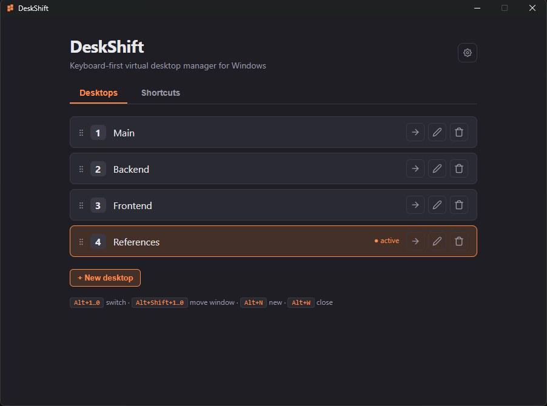
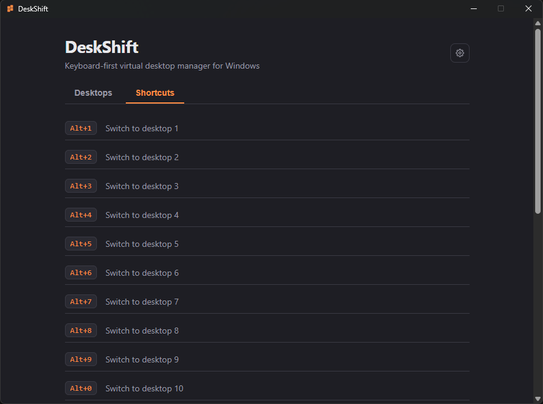
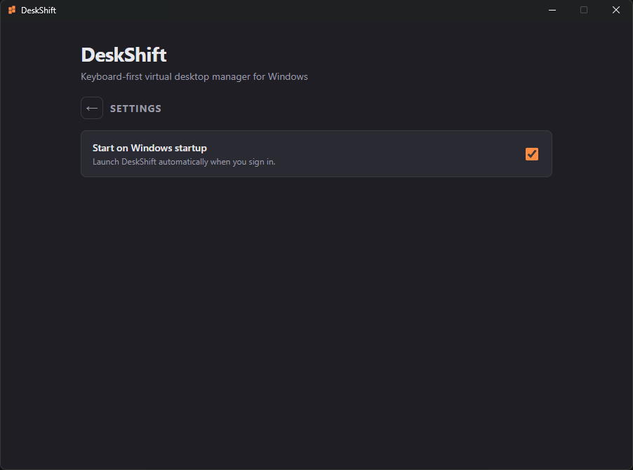

<div align="center">

# DeskShift

**Less mouse, more keyboard.**

⚡ Instant virtual-desktop management for Windows.

</div>

---

DeskShift puts your Windows virtual desktops under your fingertips. Switch desktops, move windows, and create or close workspaces instantly from your keyboard — no mouse, no digging through Task View.

<p align="center">
  
  
  
</p>


> ⚠️ **Heads up:** DeskShift is built on Windows' *undocumented* virtual-desktop COM interfaces (via the [`winvd`](https://crates.io/crates/winvd) crate). These are not a supported public API, and Microsoft changes them between Windows builds. **Requires Windows 11 24H2 (build 26100.2605) or later.**

## Features

| Shortcut | Action |
| --- | --- |
| `Alt+1` … `Alt+0` | Switch to desktop 1–10 |
| `Alt+Shift+1` … `Alt+Shift+0` | Move the active window to desktop 1–10 |
| `Alt+N` | Create a new desktop |
| `Alt+W` | Close the current desktop |

Plus a system-tray icon (reopen the window / quit) and a live view of all your desktops — with **rename** (double-click a name) and **drag-to-reorder**, kept in sync even when you change desktops in Windows' Task View.

> 🚧 **Planned:** toggle every feature on/off and rebind every shortcut from a settings UI.

## Tech stack

- [Tauri 2](https://tauri.app) — Rust backend
- [React](https://react.dev) + TypeScript + Vite — frontend
- [`winvd`](https://crates.io/crates/winvd) — Windows virtual-desktop bindings (vendored under `src-tauri/vendor/winvd` with a `move_desktop` wrapper added for reordering)
- [`tauri-plugin-global-shortcut`](https://v2.tauri.app/plugin/global-shortcut/) — global hotkeys

## Getting started

### Prerequisites

Windows 11 24H2+ and the [Tauri prerequisites](https://v2.tauri.app/start/prerequisites/):

- [Rust](https://rustup.rs) (MSVC toolchain)
- Microsoft C++ Build Tools ("Desktop development with C++")
- Node.js (LTS)

### Develop

```sh
npm install
npm run tauri dev
```

### Build

```sh
npm run tauri build
```

## Contributing

PRs and issues welcome. DeskShift is deliberately keyboard-first and dependency-light.

## License

[MIT](LICENSE) © Hisham Buteen
